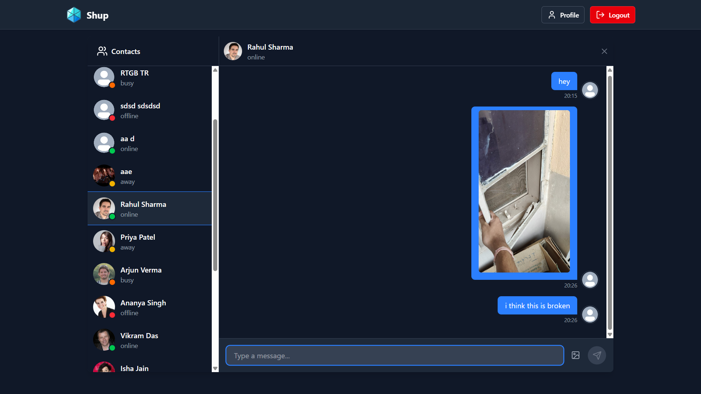
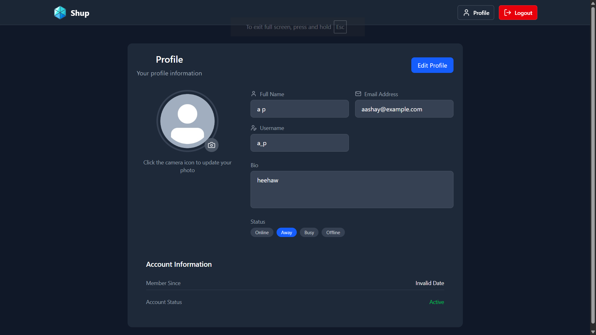

# 💬 Shup – Real-Time Chat Application

Shup is a full-stack real-time messaging application built with **React, Node.js, Express, and MongoDB**. It allows users to send and receive instant messages, view online statuses, and share images in a clean and modern UI. Powered by **Socket.IO** for real-time communication and **Cloudinary** for media storage.

---

## 🚀 Features

- ✅ Real-time 1-on-1 private messaging
- ✅ Typing indicators and online status tracking
- ✅ Image upload and sharing (via Cloudinary)
- ✅ User authentication using JWT
- ✅ Protected routes and session management
- ✅ Responsive design with Tailwind CSS
- ✅ Socket.IO for WebSocket-based messaging

---

## 🛠️ Tech Stack

**Frontend:**
- React.js
- Tailwind CSS
- Zustand (for session and UI state)
- Axios

**Backend:**
- Node.js + Express
- MongoDB + Mongoose
- Socket.IO
- Cloudinary (image uploads)
- JWT for authentication

---

## 📁Folder:
```txt
fullstackrealtimechapapp/
├── frontend/               # React client app
│   ├── components/         # Reusable UI components
│   ├── pages/              # Screens: Login, Chat, etc.
│   └── main.jsx            # App entry point
│
├── backend/                # Express server
│   ├── routes/             # Auth, Chat routes
│   ├── models/             # Mongoose schemas
│   ├── controllers/        # Business logic
│   ├── config/             # Cloudinary, DB, etc.
│   └── server.js           # WebSocket and Express config
```

## 🔐 Environment Variables

Create `.env` files in both frontend and backend folders:

### `.env` (Backend)
```env
PORT=5000
MONGO_URI=your_mongo_uri
JWT_SECRET=your_jwt_secret
CLOUDINARY_CLOUD_NAME=xxx
CLOUDINARY_API_KEY=xxx
CLOUDINARY_API_SECRET=xxx
```

## Screenshots
### 👋 Dashboard with Chat Preview


### 🪪 Profile


## 📬 Contact
- Made with ❤️ by [Aashay Patel](https://github.com/AashayPatel)
